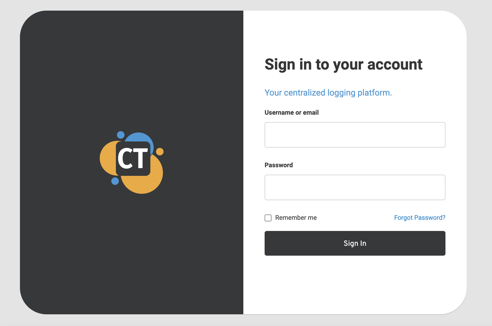

# CT Keycloak IAM

This project extends the Keycloak authentication server to cover complicated enterprise use cases such as
multi-tenancy, custom storage, n-level resellers by extending Keycloak through its SPIs such as storage,
authentication, identity provider, etc.

This project is using the Pre-Quarkus version of Keycloak.

## Features

### Custom login page

A custom theme "czetsuyatech" is configured when you run the container.

The theme is available at keycloak-docker-assembly/src/main/resources/themes/czetsuyatech and can easily be overriden.

### Custom storage

### Multi-tenant

### N-reseller level

## WIKI

- [Development Guide](docs/development.md)
- [Production Guide](docs/production.md)
- [Troubleshooting Guide](docs/troubleshooting-guide.md)
